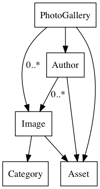
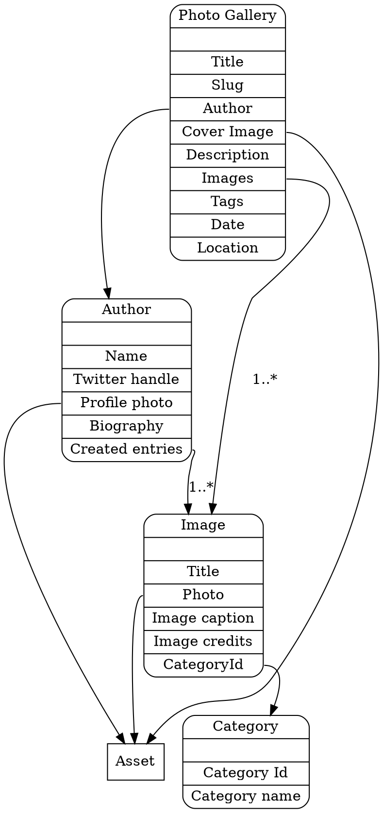

[](https://travis-ci.org/lotas/contentful-graph)
[](https://badge.fury.io/js/contentful-graph)

# contentful-graph
Visual representation of contentful content models in form of graphs

Can be exported with fields:


or without:



# Requirements

## graphviz

If you plan to render the graph as image or PDF, make sure you have `graphviz` installed on your system.

## node.js

The library is using async/await functions, so you need the latest `7` or `8` versions.

# Installation

Can be installed globally:

`npm i -g contentful-graph`

Or locally

`npm i --save-dev contentful-graph`

# Running without installation

Import script can be executed with the help of [npx](https://www.npmjs.com/package/npx)

`npx contentful-graph`

# Running import

There are several ways of running the import:

1. running CLI `bin/contentful-graph` command
2. import API and invoking functions programmatically

For this purpose, you'll need to know your contentful `spaceId` and `token`

Token may come in two flavors: Delivery token or Management token

**Management token** has an advantage of showing one-to-one relationships for models (as pointed by @jelz in #1)

## Command-line version

When running the command line version, make sure you export following variables:

```sh
CONTENTFUL_SPACE_ID= spaceId
CONTENTFUL_TOKEN= either deliveryToken
CONTENTFUL_MANAGEMENT_TOKEN= or management token
CONTENTFUL_ENVIRONMENT_ID= environment id
```

or simply in command-line:

`CONTENTFUL_ENVIRONMENT_ID=master CONTENTFUL_SPACE_ID=123 CONTENTFUL_MANAGEMENT_TOKEN=token ./bin/contentful-graph`

## Command-line options

`--help` (`-h`) Displays usage information

`--dev` (`-d`)  Includes developer information (model Id's and field Id's)

`--hide-fields` (`-n`) Do not include fields information, only entities

## Reading from local file

It is possible to run import against local file with exported model defintions:

```sh
./bin/contentful-graph ./my-contentful-model.json
```

## Web version

You can run it locally or host it on any server using [contentful-graph-web](https://github.com/lotas/contentful-graph-web)

```sh
docker run -it --rm -p 3000:3000 lotas/contentful-graph-web
# or checkout project locally and
make BUILD && make RUN
# or if you have graphviz in your system simply
npm run dev
```

## Api version

Package exposes following functions:

`getContentTypesFromManagementApi(spaceId: string, managementToken: string, environment: string): Promise<Object>`

Will import content types from contentful using management api

`getContentTypesFromDistributionApi(spaceId: string, apiToken: string, environment: string): Promise<Object>`

Will import content types from contentful using distributions api

`contentTypesToModelMap(contentTypes: Object): Object`

Will enrich existing content types with mapping information (one-to-one, one-to-many)

`modelsMapToDot(modelsMap: Object, {hideEntityFields: Boolean, dev: Boolean}): String`

Will create dot graph definition out of the model map

You can use them as follows:

```javascript
const convertApi = require('contentful-graph');

// either with managementToken
const contentTypes = await convertApi.getContentTypesFromManagementApi(spaceId, managementToken);
// or with apiToken, you just need one of the calls
const contentTypes = await convertApi.getContentTypesFromDistributionApi(spaceId, apiToken);

// enrich content types with relationship definitions
const modelsMap = convertApi.contentTypesToModelMap(contentTypes);

// generate dot string that can be passed to graphviz
const dotStr = convertApi.modelsMapToDot(modelsMap, {});
```

# Generating graphs

After you would run the import, you should have something like this:



To render this to image or PDF, pipe it to the `dot` command:

```sh
./import.js | dot -Tpng > model.png
./import.js | dot -Tpdf > model.pdf
```

Where `./import` is the script that produces `dot` output

## Links

[Contentful Management API](https://www.contentful.com/developers/docs/references/content-management-api/#/reference/content-types)

[Contentful Delivery API](https://www.contentful.com/developers/docs/references/content-delivery-api/#/reference/content-types)

[GraphViz Fiddle](http://stamm-wilbrandt.de/GraphvizFiddle/)
